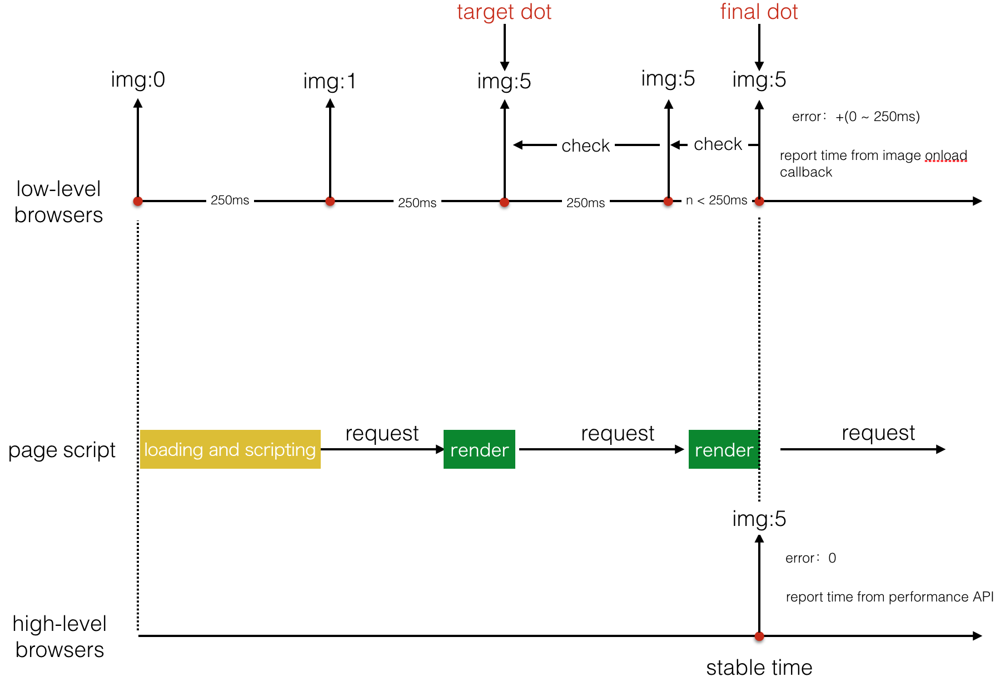

## What is this ?

A tool for computing first screen time of one page with inaccuracy less than 250ms automatically.

## What's the defination of *first screen time* ?

+   If there are images existing in first screen, the defination is: 

    ```
    the time when all images in first screen loaded.
    ```

+   If there is no image existing in first screen, the defination is:

    ```
    performance.timing.domContentLoadedStart
    ```

## Precision

The distance between average tested time and real first screen time is `+(0 ~ 250ms)` (tested in wifi/fast 3G/slow 3G)

## How To Use

`auto-compute-first-screen-time` use libaray of `umd`.

So, you can use it by:

+   `<script src="./auto-compute-first-screen-time/dist/index.js"></script>`

    `var autoComputeFirstScreenTime = window.autoComputeFirstScreenTime`.

+   `var autoComputeFirstScreenTime = require('auto-compute-first-screen-time');`

And then use it:

+   compute first screen time automatically

    Run this code before the scripts of page running.

    ```javascript
    autoComputeFirstScreenTime({
        onReport: function (result) {
            if (result.success) {
                console.log(result.firstScreenTime)
            } else {
                console.log(result);
            }
        }
    });

    // other scripts of current page
    // ...
    ```

+   compute first screen time by hand when you find it ready

    ```javascript
    autoComputeFirstScreenTime.report({
        // required: false
        onReport: function (result) {
            if (result.success) {
                console.log(result.firstScreenTime)
            } else {
                console.log(result);
            }
        }
    });
    ```

+   options

    Options means `autoComputeFirstScreenTime(options)` and `autoComputeFirstScreenTime.report(options)`.

    +   `options.type`

        Computing type, which should be one of below: `auto/perf/dot`. `auto` by default.

    +   `options.onReport`

        +   type: `Function`
        +   default

            ```javascript
            onReport: function (result) {
                // blank function
            }
            ```

        +   description

            It will run when first screen time is found.

            ```javascript
            onReport: function (result) {
                if (result.success) {
                    console.log(result.firstScreenTime)
                } else {
                    console.log(result);
                }
            }
            ```

    +   `options.request`
        +   type: `Object`
        +   description

            ```javascript
            limitedIn: [], // RegExp as item
            exclude: [] // RegExp as item
            ```

            `auto-compute-first-screen-time` will catch request for computing first screen time.

            `limitedIn` controls which kind of requests should be caught, such as `[/mtop\.alibaba\.com/i]`.

            `exclue` controls which kind of requests should not be caught, such as `[/list\.alibaba\.com/i]`.

    +   `options.delayReport`

        +   type: `Number`
        +   default: `0`
        +   description

            `auto-compute-first-screen-time` will run `onReport` callback immediately by default.

            When `delayReport` is setted, `auto-compute-first-screen-time` will run `onReport` after some time.

            It can be used in some pages that require users login.

            Delay report can help you avoid report the wrong page (always login page).

            For example:

            ```javascript
            delayReport: 1000 // ms
            ```

    +   `options.jsonpFilter`

        +   type: `RegExp`
        +   default: `/jsonp=callback/`
        +   description

            Filter for cathing jsonp request.
 
    +   `options.navigationStartChangeTag`

        +   type: `Array`
        +   default: `['data-perf-start', 'perf-start']`
        +   description

            Usually, when first screen time stamp is found, we get the first screen time by:

            ```javascript
            var firstScreenTime = firstScreenTimeStamp - performance.timing.navigationStart
            ```

            But for single-page-application(SPA), it's wrong.

            Because SPA has sub routes, when route changes, the first screen time should be computed by:

            ```javascript
            firstScreenTimeStamp - the-timestamp-when-route-changed
            ```

            `auto-compute-first-screen-time` will watch `options.navigationStartChangeTag` changes when computing first screen.

            `'data-perf-start'` will be watched firstly, if there is no `'data-perf-start'`, `'perf-start'` will be watched. **And the tags must be setted on `<body>`**.

            So for SPA, you should do one more job: when route changes, reset `perf-start` or `data-perf-start` on `<body>`.

            For example by vue SPA:

            ```javascript
            router.afterEach(function(to, from) {
                document.body.dataset.perfStart = Date.now();
            })
            ```

+   Dom control

    +   `perf-ignore`

        ignore images inside the tagged dom (tagged dom included)

        ```html
        <div>
            
        </div>
        <div perf-ignore> <!-- ignored -->
             <!-- ignored -->
        </div>

        <div perf-ignore style="background: url(xxx) 0 0 no-repeat;"></div> <!-- ignored -->
        ```

    +   `<anytag perf-scroll></anytag>`

        `anytag` means tags like `div / span / ul / ...`.

        Usually, when we get images in first screen, we should firstly get node position by formula as below:

        ```
        var scrollTop = document.documentElement.scrollTop || document.body.scrollTop; // changeable

        var boundingClientRect = imgNode.getBoundingClientRect();
        if ((scrollTop + boundingClientRect.top) < window.innerHeight && boundingClientRect.right > 0 && boundingClientRect.left < window.innerWidth) {
            console.log('this node is in first screen');
        }
        ```

        When `perf-scroll` is added on a tag, part of the formula will change as below:

        from
        
        ```
        var scrollTop = document.documentElement.scrollTop || document.body.scrollTop;
        ```
        
        to 
        
        ```
        var scrollTop = document.querySelector('[perf-scroll]').getBoundingClientRect().top;

        if (scrollWrapperClientRect.top < 0) {
            scrollTop = -scrollWrapperClientRect.top;
        } else {
            scrollTop = 0;
        }
        ```

## Support xhr ?

Yes!

## Support fetch ?

Yes!

## Support jsonp ?

Yes!

## Support async js like webpack split bundle ?

Yes!

## Details



## TODO

+   tests
+   bugfix

## LICENSE

BSD