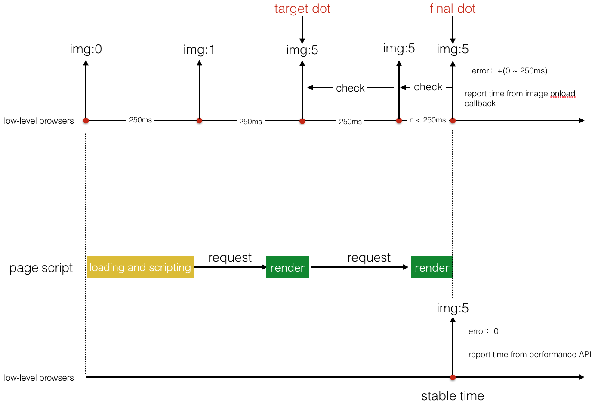

**Status: beta**

## What is this ?

A tool for auto computing first screen time of one page with inaccuracy less than 200ms.

## What's the defination of *first screen time* ?

+   If there are images existing in first screen, the defination is: 

    ```
    the-time-at-which-all-images-in-first-screen-are-downloaded  -  window.performance.timing.navigationStart
    ```

+   If there is no image existing in first screen, the defination is:

    ```
    the-time-at-which-dom-changes-no-more  -  window.performance.timing.navigationStart
    ```

## Precision

the distance between average tested time and real first screen time is less than 200ms (tested in wifi/fast 3G/slow 3G)

## How To Use

+   auto compute first screen time

    run this code before the scripts of page run.

    ```
    var autoComputeFirstScreenTime = require('auto-compute-first-screen-time');
    
    autoComputeFirstScreenTime({
        request: {
            /*
             * the async request that will be caught for computing first screen time;
             * RegExp Required;
             * example: [/mtop\.alibaba\.com/i]
             */
            limitedIn: [],

            /* the async request that won't be caught for computing first screen time;
             * RegExp Required;
             * example: [/list\.alibaba\.com/i]
             */
            exclude: []
        },

        // callback after first screen was got
        onTimeFound: function (result) {
            if (result.success) {
                console.log(result.firstScreenTime)
            } else {
                console.log(result);
            }
        }
    });

    // other scripts of current page
    // ...
    ```

+   compute first screen time by hand when ready

    ```
    var autoComputeFirstScreenTime = require('auto-compute-first-screen-time');

    autoComputeFirstScreenTime.report({
        onTimeFound: function (result) {
            if (result.success) {
                console.log(result.firstScreenTime)
            } else {
                console.log(result);
            }
        }
    });

    // other scripts of current page
    // ...
    ```

## Support xhr ?

Yes!

## Support fetch ?

Yes!

## Details



## LICENSE

BSD